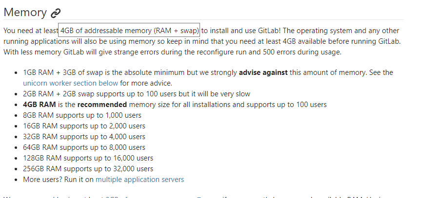

## 0. 前言
弟弟组队参加比赛，由于是多人一起进行代码开发，需要私人Git服务器来管理代码。而且一直在进行开发，也积累了不少代码，有些代码不适合放在github上进行托管，而仅在本地存放代码又很容因为硬盘损害等原因导致代码丢失，因此急需要一个类似github的网站来托管这些私人的代码和文件。

## 1. 为什么使用gogs?
提供web界面的开源git服务器，知名的有gitlb，bitbucket和gogs。

在这三个开源git服务器中我主要尝试了gitlab和gogs。最开始我是选用了gitlab的，主要是因为gitlab知名度高，而且功能比较齐全，可靠性高。于是我便按照gitlab的安装文档在服务器上部署安装gitlab，安装了gitlab后测试发现功能和github很接近，是能够满足我的要求的。

但是在运行了半天左右，我发现服务器出现了重启，定位了发现是因为服务器内存不足导致服务器重启的。后来在gitlab的官网中发现只要需要4G内存才能流畅的运行gitlab。

而对于只有2GB内存的渣渣服务器来说，只能放弃这个方案了。

后面在网上搜索到gogs，这个国人开发的自助git服务，而且gogs具有以下特点：
1. 容易安装；
2. 跨平台，目前在Windows、Mac、Linux和ARM上都能运行；
3. 轻量级，一个廉价的树莓派的配置都能够将gogs跑起来。

看了这些感觉棒极了，正好适合我这样的个人使用了。

## 3. 安装MySQL
由于gogs支持MySQL、PostgreSQL、MSSQL、TiDB和SQLite3，这里直接选择MySQL作为数据库。
查看gogs对MySQL的版本要求至少要5.7版本。

但是安装了MySQL 5.7后，发现内存占用特别高，没有业务运行的时候，都要占用到1.5G左右。对于只有2G内存的服务器来说这样肯定无法接受。查询了资料发现MySQL占用内存高是最近版本刚出现的问题，在之前的版本就没有这样的问题。于是我就下载了MySQL 5.5的安装包，安装了之后内存占用确实下降了很多。

虽然gogs要求MySQL的版本至少要5.7版本，但是目前我安装了MySQL 5.5版本目前还没有发现有什么问题。

## 4. 部署gogs
1. 建立git用户
gogs默认以git用户运行，因为在运行过程中会修改.ssh配置文件，如果在root用户运行，修改.ssh配置文件是件很危险的事情。
使用下面的命令创建git用户，并且使用git用户登录。
```
adduser git
su git
```

2. 生成ssh秘钥
切换到git用户的主目录后，需要生成ssh秘钥：
```
ssh-keygen -t rsa
```

执行后，会在.ssh目录生成ssh秘钥的配置信息，如下图所示：


3. 下载安装包
我使用的是预编译的二进制包。需要从源码编译的话，请参考一般 Go 语言项目的编译。下载后解包到/home/git/gogs/。文件夹的内容如下。


4. 建立数据库
在gogs的script/mysql.sql文件中是用来初始化数据库的文件。执行下面的命令初始化数据库。
```
mysql -u root -p < scripts/mysql.sql
```

5. 配置数据库用户
登录mysql数据库创建一个新用户，并将数据库gogs的所有权限赋给该用户。
```
$ mysql -u root -p
> # （输入密码）
> create user 'gogs'@'localhost' identified by '密码';
> grant all privileges on gogs.* to 'gogs'@'localhost';
> flush privileges;
> exit;
```

6. 运行gogs
经过上面的配置，已经可以将gogs运行起来了。切换到gogs目录中，运行下面的命令：
```
./gogs web
```


gogs运行起来后，由于gogs默认监听的是3000端口，可以用使用[http://服务器IP:3000](http://服务器IP:3000)访问gogs的web页面。

如果是初次登录该网站的话，需要配置一些信息，将这些信息填写完成后提交就可以了。

经过上述的配置后，登录到gogs中，即可看到用户界面：


## 5. 服务启动
可以将gogs以服务形式后台启动。
将scripts文件夹中找到对应发行版的脚本，将脚本放在/etc/init.d/目录中，名字为gogs.service，给予执行权限并修改相关参数。

```
service gogs start   启动gogs服务
service gogs stop    停止gogs服务
```

## 6. 参考文献
[1] [使用 Gogs 搭建自己的 Git 服务器](https://blog.mynook.info/post/host-your-own-git-server-using-gogs/)
[2] [Gogs is a painless self-hosted Git service.](https://github.com/gogits/gogs)
