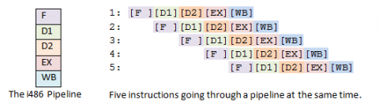

# 1. 引言
最近在看VFS的源码，发现在if语句中大量使用了likely和unlikely这两个宏，就像以下代码所示：
```
int error = path_lookupat(nd, flags | LOOKUP_DIRECTORY, &path);
if (unlikely(error))
	return error;
```
经过学习后，知道调用likely()或unlikely()告诉编译器这个条件很有可能或者不太有可能发生，好让编译器对这个条件判断进行正确地优化。这两个宏的定义如下：
```
# define likely(x)	__builtin_expect(!!(x), 1)
# define unlikely(x)	__builtin_expect(!!(x), 0)
```
从宏的定义可以看出likely和unlikely都是使用`__builtin_expect`来实现的，其中`__builtin_expect`是GCC提供的內建函数，用于给GCC提供分支预测优化信息。

# 2. `__builtin_expect`內建函数

## 2.1 功能说明
GCC文档中对于函数的说明如下：
>— Built-in Function: long `__builtin_expect` (long exp, long c)
>You may use `__builtin_expect` to provide the compiler with branch prediction information. In general, you should prefer to use actual profile feedback for this (-fprofile-arcs), as programmers are notoriously bad at predicting how their programs actually perform. However, there are applications in which this data is hard to collect.

>The return value is the value of exp, which should be an integral expression. The semantics of the built-in are that it is expected that exp == c. For example:

>          if (__builtin_expect (x, 0))
>            foo ();
> indicates that we do not expect to call foo, since we expect x to be zero. Since you are limited to integral expressions for exp, you should use constructions such as

>          if (__builtin_expect (ptr != NULL, 1))
>            foo (*ptr);
>when testing pointer or floating-point values.

# 3. 优化原理
## 3.1 避免指令跳转！！！
我们知道目前的CPU无一例外的都引入了流水线技术，用于加快指令的执行，提高CPU的性能。换句话说，就是CPU在处理当前指令的同时，会先取出后面的多条指令进行预处理，如下图所示：

I486拥有五级流水线。分别是：取指(Fetch)，译码(D1, main decode)，转址(D2, translate)，执行(EX, execute)，写回(WB)。某个指令可以在流水线的任何一级。
从上图可见，流水线将原本串行执行的指令变成了并行执行了，极大的提高了指令的执行效率。但是如果存在跳转指令，那么之前预取的指令都没有用了，需要从内存中重新取出跳转后的指令继续执行。因此跳转指令会降低流水线的效率，从而降低CPU的性能。
我们在编写程序时要尽量避免跳转指令，让指令尽可能的顺序执行。

那么，我们如何避免跳转指令呢？可以使用前面所说的__builtin_expect函数。

## 3.2 编译器的优化工作

>注：本节的内容是学习了[FAQ/LikelyUnlikely](https://kernelnewbies.org/FAQ/LikelyUnlikely)这篇文章而写，自己根据文章的例子动手实践了一下。

从GCC的说明中可知，__builtin_expect的主要作用就是：帮助编译器判断条件跳转的预期值，避免因执行jmp跳转指令造成时间浪费。那么它是怎么帮助编译器进行优化的呢？
编译器优化时，根据条件跳转的预期值，按正确地顺序生成汇编代码，把“很有可能发生”的条件分支放在顺序执行指令段，而不是jmp指令段（jmp指令会打乱CPU的指令执行顺序，大大影响CPU指令执行效率）。

likely和unlikely主要用于if语句中，我们知道if语句分为3种形式：
1. if
```
	if (condition) {
		statement;
	}
```
2. if-else
```
	if (condition) {
		statement;
	} else {
		statement;
	}
```
3. if-else-if
```
	if (condition) {
		statement;
	} else if {
		statement;
	} else {
		statement;
	}
```
其中，if-else-if目前还没有遇到这种情况下会用到likely和unlikely的，后面遇到的话再进行研究。本文主要研究前两种情况。

### 3.2.1 if
下面举例说明。下面这个简单的C程序使用gcc -O2进行编译。
```
#include <stdio.h>
#include <stdlib.h>

#define likely(x)    __builtin_expect(!!(x), 1)
#define unlikely(x)  __builtin_expect(!!(x), 0)

int main(int argc, char *argv[])
{
    int a;

    /*获取GCC无法优化的值*/
    a  = atoi(argv[1]);

    if (likely(a != 2)) {
        a++;
    }
    
    printf("%d\n", a);

    return 0;
}
```
使用objdump -S反汇编，查看它的汇编代码。
```
0000000000400510 <main>:
  // 调用atoi()
  400510:	48 83 ec 08          	sub    $0x8,%rsp
  400514:	48 8b 7e 08          	mov    0x8(%rsi),%rdi
  400518:	ba 0a 00 00 00       	mov    $0xa,%edx
  40051d:	31 f6                	xor    %esi,%esi
  40051f:	e8 ec fe ff ff       	callq  400410 <strtol@plt>

  // 测试 a != 2的值
  400524:	83 f8 02             	cmp    $0x2,%eax
  400527:	89 c6                	mov    %eax,%esi

  // 如果a等于2的话，就会跳转；如果a不等于2的话，就会继续执行，不会破坏
  // CPU的指令执行顺序
  400529:	74 03                	je     40052e <main+0x1e>

  // a++;
  40052b:	83 c6 01             	add    $0x1,%esi

  // 调用printf
  40052e:	bf 48 06 40 00       	mov    $0x400648,%edi
  400533:	31 c0                	xor    %eax,%eax
  400535:	e8 b6 fe ff ff       	callq  4003f0 <printf@plt>
  40053a:	31 c0                	xor    %eax,%eax
  40053c:	48 83 c4 08          	add    $0x8,%rsp
  400540:	c3                   	retq   
  400541:	90                   	nop
```
在上面程序中，用unlikely()代替其中的likely()，重新编译，再来看它的汇编代码：
```
0000000000400510 <main>:
  // 调用atoi()
  400510:	48 83 ec 08          	sub    $0x8,%rsp
  400514:	48 8b 7e 08          	mov    0x8(%rsi),%rdi
  400518:	ba 0a 00 00 00       	mov    $0xa,%edx
  40051d:	31 f6                	xor    %esi,%esi
  40051f:	e8 ec fe ff ff       	callq  400410 <strtol@plt>

  // 测试a != 2的值
  400524:	83 f8 02             	cmp    $0x2,%eax
  400527:	89 c6                	mov    %eax,%esi

  // 如果a不等于2的话，就会跳转；如果a等于2的话，就会继续执行，不会破坏
  // CPU的指令执行顺序
  400529:	75 13                	jne    40053e <main+0x2e>

  // 调用printf
  40052b:	bf 48 06 40 00       	mov    $0x400648,%edi
  400530:	31 c0                	xor    %eax,%eax
  400532:	e8 b9 fe ff ff       	callq  4003f0 <printf@plt>
  400537:	31 c0                	xor    %eax,%eax
  400539:	48 83 c4 08          	add    $0x8,%rsp
  40053d:	c3                   	retq   
  
  // a++;
  40053e:	83 c6 01             	add    $0x1,%esi
  400541:	eb e8                	jmp    40052b <main+0x1b>
  400543:	90                   	nop
```

### 3.2.2 if-else
下面举例说明。下面这个简单的C程序使用gcc -O2进行编译。

```
#include <stdio.h>
#include <stdlib.h>

#define likely(x)    __builtin_expect(!!(x), 1)
#define unlikely(x)  __builtin_expect(!!(x), 0)

int main(int argc, char *argv[])
{
    int a;

    /*获取GCC无法优化的值*/
    a  = atoi(argv[1]);

    if (likely(a==2)) {
        a++;
    } else {
        a--;
    }

    printf("%d\n", a);

    return 0;
}
```
使用objdump -S反汇编，查看它的汇编代码。
```
0000000000400510 <main>:
  // 调用atoi
  400510:	48 83 ec 08          	sub    $0x8,%rsp
  400514:	48 8b 7e 08          	mov    0x8(%rsi),%rdi
  400518:	ba 0a 00 00 00       	mov    $0xa,%edx
  40051d:	31 f6                	xor    %esi,%esi
  40051f:	e8 ec fe ff ff       	callq  400410 <strtol@plt>

  // 测试 a == 2 的值
  400524:	83 f8 02             	cmp    $0x2,%eax

  // 如果 a == 2的话，会继续执行a++指令，不会进行跳转，这样就不会
  // 破坏CPU的预读处理。只有当a != 2时会进行跳转到400541处执行a--。
  400527:	75 18                	jne    400541 <main+0x31>
  
  // 因为a == 2,则gcc编译器将a++直接优化成0x3
  400529:	be 03 00 00 00       	mov    $0x3,%esi

  // 调用printf
  40052e:	bf 48 06 40 00       	mov    $0x400648,%edi
  400533:	31 c0                	xor    %eax,%eax
  400535:	e8 b6 fe ff ff       	callq  4003f0 <printf@plt>
  40053a:	31 c0                	xor    %eax,%eax
  40053c:	48 83 c4 08          	add    $0x8,%rsp
  400540:	c3                   	retq   

  // a--;
  400541:	8d 70 ff             	lea    -0x1(%rax),%esi
  400544:	eb e8                	jmp    40052e <main+0x1e>

  400546:	90                   	nop
```
在上面程序中，用unlikely()代替其中的likely()，重新编译，再来看它的汇编代码：
```
0000000000400510 <main>:
  // 调用atoi
  400510:	48 83 ec 08          	sub    $0x8,%rsp
  400514:	48 8b 7e 08          	mov    0x8(%rsi),%rdi
  400518:	ba 0a 00 00 00       	mov    $0xa,%edx
  40051d:	31 f6                	xor    %esi,%esi
  40051f:	e8 ec fe ff ff       	callq  400410 <strtol@plt>

  // 测试 a == 2 的值
  400524:	83 f8 02             	cmp    $0x2,%eax

  // 如果 a == 2的话，会进行跳转到40053f处执行a++。而当 a!= 2时顺序执行
  // a--指令，不会进行跳转，这样就不会破坏CPU的预读处理。
  400527:	74 16                	je     40053f <main+0x2f>

  // a--;
  400529:	8d 70 ff             	lea    -0x1(%rax),%esi

  // 调用printf
  40052c:	bf 48 06 40 00       	mov    $0x400648,%edi
  400531:	31 c0                	xor    %eax,%eax
  400533:	e8 b8 fe ff ff       	callq  4003f0 <printf@plt>
  400538:	31 c0                	xor    %eax,%eax
  40053a:	48 83 c4 08          	add    $0x8,%rsp
  40053e:	c3                   	retq   

  // a++; 因为a == 2,则gcc编译器将a++直接优化成0x3
  40053f:	be 03 00 00 00       	mov    $0x3,%esi
  400544:	eb e6                	jmp    40052c <main+0x1c>
  400546:	90                   	nop
```
可见，编译器利用程序员作出的判断，生成了高效的汇编码。即，跳转语句不生效的概率很大。

# 4. 如何使用
在一个条件判断语句中，当这个条件被认为是非常非常有可能满足时，则使用likely()宏，否则，条件非常非常不可能或很难满足时，则使用unlikely()宏。

# 5. 参考文献
1. [FAQ/LikelyUnlikely](https://kernelnewbies.org/FAQ/LikelyUnlikely)
2. [likely(x)与unlikely(x)函数，即__builtin_expect的使用](http://velep.com/archives/795.html)
3. [__builtin_expect — 分支预测优化](http://www.cnblogs.com/LubinLew/p/GCC-__builtin_expect.html)
4. [Why do we use __builtin_expect when a straightforward way is to use if-else](http://stackoverflow.com/questions/7346929/why-do-we-use-builtin-expect-when-a-straightforward-way-is-to-use-if-else)
5. [Other Built-in Functions Provided by GCC](https://gcc.gnu.org/onlinedocs/gcc/Other-Builtins.html)
6. [【整理】__builtin_expect 解惑](https://my.oschina.net/moooofly/blog/175019)
7. [GCC __builtin_expect的作用](https://my.oschina.net/linjiezang/blog/805156)
