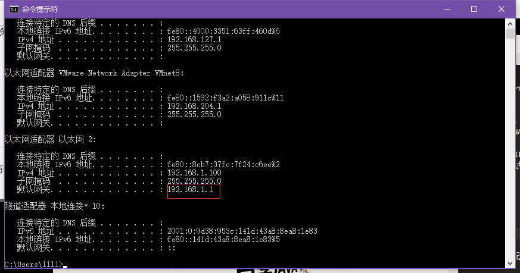
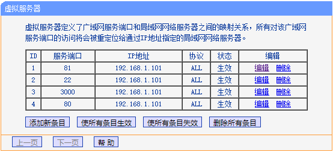

## 0. 前言

之前花了100元买了公司淘汰下来的一批电脑，配置还可以，但缺少硬盘和显示器没法工作，前段时间懒得去配置，就一直闲置在那里了，现在想想怪可惜的。由于最近要搞一个聊天机器人的应用，需要将应用部署在服务器上去调试，就需要找一个合适的服务器去部署应用。一开始准备购买云主机，但是云主机需要花费一大笔资金，对于只是测试和个人使用的网站应用来说太浪费了。所以我就准备把这台旧电脑拉过来当做服务器来使用。


## 1. 准备主机
使用queryhw.sh脚本查询旧主机的配置
```
[root@localhost ~]# sh queryhw.sh
CPU:  Intel(R) Core(TM)2 Duo CPU     E7500  @ 2.93GHz (1*2Cores)
MotherBoard: Dell Inc. Vostro 230(DGG6X2X)
Memory:2 GB(Samsung DDR3 1333 MHz/Samsung DDR3 1333 MHz/)
OS_RELEASE: CentOS_release_x86_64
OS_DETAIL: Linux localhost.localdomain 3.10.0-693.el7.x86_64 x86_64
```
可以看到旧主机的配置还是可以的，用来作为个人使用的旧服务器还是绰绰有余的。

后面买了一个1TB的硬盘配置好后，安装了最新的CentOS 7系统。


## 2. 安装系统

我选择比较常用的[CentOS 7 Minimal ISO](http://isoredirect.centos.org/centos/7/isos/x86_64/CentOS-7-x86_64-Minimal-1708.iso)。由于主机上没有光驱软件，就需要使用下载的系统镜像制作了启动U盘。

制作启动U盘的步骤参照[使用UltraISO（软碟通）制作U盘启动盘完整教程](https://jingyan.baidu.com/article/5225f26b0bb45fe6fa0908bc.html)。

制作了启动U盘后，使用制作的启动U盘安装系统。

## 3. 内网穿透
家里使用的是电信的8M宽带，并且使用TPLINK无线路由器让家里的设备联网，组成了小的局域网。由于想要用旧主机作为服务器，那就必须能够从外网访问内网（家庭局域网）中的服务器，于是研究了一下常用的内网穿透工具。

### 3.1 电信内网IP
在配置的过程中，发现电信居然给我分配的是内网IP，不是固定的公网IP。这样我就没有办法在外网直接通过IP访问内网中的服务器，其他还有电驴不能玩、BT下载不支持、NAS无法进行FTP和远程传输，连接数限制很大等问题。

由于内网IP存在这些问题，必须要将内网IP转成公网IP，通过联系电信客服，大概30分钟就给办好了。将家中的路由器重启后，后面分配的IP就是公网的IP了。而且经过测试，可以从外网直接通过内网中的服务器了。

解决了这个问题后，后面可以继续配置内网穿透功能。


### 3.2 路由器端口映射
1. 设置端口映射首先需要判断路由器的IP地址，一盘就是当前上网网关。通过ipconfig查看默认网关设置。


2. 在浏览器中打开路由器的地址，如[http://192.168.1.1](http://192.168.1.1)，然后登陆到路由器中，默认的用户名密码是admin/admin。

目前常用的内网穿透工具就是花生壳了，功能强大，配置比较完善，而且TPLINK本身就支持花生壳的域名解析。当然缺点是目前花生壳只支持对

3. 打开TPLINK系统后，找到“转发规则/虚拟服务器”：


4. 根据需要映射的端口和服务器的IP进行配置：


经过上述步骤的配置后，就能通过外网直接访问到内网中的服务器了。

### 3.3 内网域名解析
虽然前面已经找电信修改成公网IP，但是每次重启路由器都会重新分配一个IP，这样就导致使用IP访问非常麻烦，因为时常需要查询分配的IP是什么，非常麻烦。后面查询到可以使用花生壳的动态域名解析功能让其可以使用域名访问。

而且TPLINK路由器本身也是支持花生壳域名解析功能，需要在花生壳账号和域名。目前使用的是免费的域名，虽然难记，但是因为当前的服务器仅仅是个人调试使用，也是够用了。经过设置后，其配置如下：


使用了域名来访问服务器后，就不用再担心后面因为重新分配IP导致无法访问的问题了，因为花生壳会自动为域名绑定到新的IP上，保证域名都是能够使用的。


经过上述配置后，就能够在外网正常的访问内网中的服务器了。
目前服务器已经开始运行。


