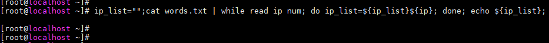
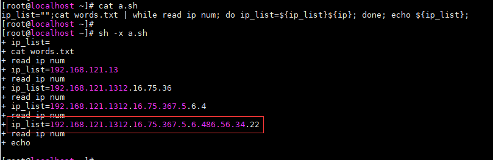
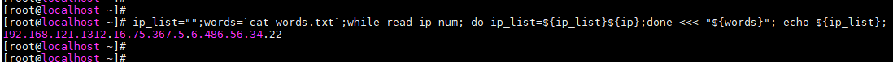

## 0. 前言
今天在编写Shell脚本的时候，遇到了一个语法问题，折磨了我挺久的，就把这个问题记录下来，也算一种收获吧。

```
[root@localhost ~]# cat words.txt
192.168.121.13 14
12.16.75.36 16
7.5.6.4 88
86.56.34.22 77


ip_list="";cat words.txt | while read ip num; do ip_list=${ip_list}${ip}; done; echo ${ip_list};
```

执行上述的脚本，就会发现打印出来的信息是空的。



## 1. 问题定位
使用shell的debug功能进行调试功能，发现其实while循环内ip_list里面是有值的，但是当在while循环外ip_list是没有值的。


最后才搞明白是因为管道的原因导致的，在使用管道的时候会先fork出来一个子进程，后续的命令都是在子进程中执行的，而在while循环外的变量ip_list没有传给子进程，导致在子进程无法根本无法修改处于父进程的ip_list。所以导致打印出来的ip_list是空的。


## 2. 解决办法
在处理的过程中不使用管道就不会出现问题，修改之后的shell脚本如下：
```
ip_list="";words=`cat words.txt`;while read ip num; do ip_list=${ip_list}${ip};done <<< "${words}"; echo ${ip_list};
```

将shell脚本修改了之后，能够正常打印出来ip信息。



## 3. 参考文献
[1] [linux shell 中 “while read line”循环内改变变量值，为何不能影响循环外的变量。](https://zhidao.baidu.com/question/200385629817105165.html)
[2] [Shell变量while循环内改变无法传递到循环外](https://blog.csdn.net/shawhe/article/details/65631543)
